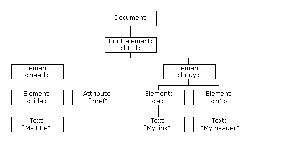

# Writing and Presentation Week 2

## Js Dasar-Scope

- Scope dalam JavaScript adalah konsep yang digunakan untuk membatasi pengaksesan suatu variabel.

- Global scope adalah scope yang paling luar di JavaScript.

    ```js
    let hewan = 'kucing' // global scope

        function ragamHewan() {
            return hewan
        }
    console.log(hewan) // output kucing
    ```
- Local scope mendeklarasikan variabel didalam blocks seperti function, conditional, dan looping.
    ```js
    function ragamHewan() {
        let hewan = 'kucing'
        console.log(hewan)
     }
    ragamHewan()
    ```

- Blocks adalah code yang berada didalam curly braces {}. Conditional, function, dan  looping menggunakan blocks.


## Js Dasar-Function

- Function adalah sebuah blok kode dalam sebuah grup untuk menyelesaikan 1 task/1 fitur. Saat kita membutuhkan fitur tersebut nantinya, kita bisa kembali menggunakannya.

- Ada 4 cara yang bisa kita lakukan untuk membuat fungsi di Javascript:

    - Menggunakan cara biasa;
        ```js
        function namafunction(){
            console.log("Hello")
        }
        ```
    - Membuat Fungsi dengan Ekspresi
        ```js
        let namaFunction = function(){
            console.log("Hello febrianto")
        } 
        ```
    - Membuat Fungsi dengan Tanda Panah
        ```js
        let namaFunction = () => {
            console.log("Hello");
        }
        ```
    - Membuat Fungsi dengan Kostruktor
        ```js
        let namaFunction = new Function('console.log("Hello");');
        ```

- Memanggil atau Eksekusi Fungsi
    ```js
    let namaFunction = () => {
            console.log("Hello febrianto");
        }
    
    namaFunction() // output Hello febrianto
    ```

- Fungsi dengan parameter 
    
    Parameter adalah variabel yang menyimpan nilai untuk diproses di dalam fungsi.
    ```js
    function hitung(a, b) {
        return hasilHitung = a + b
    
    }
    console.log(hitung(4, 5))
    ```


&nbsp;


## Java Script Dasar Data Type Built in Prototype & Method

- Data Type

    tipe data adalah cara kita memberitahu komputer untuk mengelompokkan data berdasarkan apa yang dipahami oleh komputer. Karena JavaScript menggunakan konsep typeless programming language, maka tipe data dari sebuah variabel akan ditentukan dari nilai yang disimpan.

- Jenis-jenis Tipe Data JavaScript

    JavaScript terdiri dari 2 kelompok, yakni tipe data primitif (primitive type), dan tipe data object.

    - Primitive Type

        Di dalam JavaScript terdapat 5 tipe data primitif:
        - Numbers 
        
            Tipe data Number adalah salah satu tipe data yang dapat digunakan untuk menunjukan nilai numerik di JavaScript.
            ``` js
            let umur = 19

            console.log(umur) // output 19
            ```
        
        - String

            String digunakan menyimpan karakter berupa text. Di JavaScript string ditulis dalam tanda petik 1(‘ ‘) atau petik 2 (” “).
            ```js
            let nama = "febrianto"
            let asal = 'Palu'

            console.log("Perkenalkan nama saya : " , nama ) // Perkenalkan nama saya :  febrianto
            console.log("Asal : ", asal) // Palu
            ```
        
        - Boolean

            Boolean memiliki 2 bentuk nilai yaitu true dan false.
            ```js
            // Mencari bilangan genap
            let a = 11

            if (a % 2 == 0) {
                console.log(true)
            }else {
                console.log(false)
            } // output : false
            ```

        - Undifined

            Sebuah variabel jika tidak ditetapkan nilainya maka data variabel tersebut akan disebut sebagi undifined. Undifined menjadi penanda bahwa ada kesalahan dalam script program dalam hal pendeklarasian dan pemanggilan variabel data.

        - Null

            Null adalah tipe data primitive yang nilainya null. Perbedaan nilai null dan undefined terletak pada tipenya, null merupakan pointer untuk object yang kosong sehingga ketika dicek menggunakan operator typeof hasil outputnya yaitu object.

    - Non Primitive Type

        - Objects
            Tipe data 
            
            object pada Javascript merupakan tipe data kompleks yang berisi kumpulan properti (props), setiap properti berisi pasangan key:value.
            ```js
            let data = {
                nama: "Febrianto",
                age: 19,
                status : "Mahasiswa"
            }

            console.log(data.nama) // febrianto
            ```
        
        - Array

            Tipe data array adalah tipe data yang mampu menyimpan banyak data didalam satu buah variabel.


&nbsp;

## JavaScript Dasar - DOM

- Apa itu DOM 

    DOM merupakan singkatan dari Document Object Model Artinya, dokumen (HTML) yang dimodelkan dalam sebuah objek.

    Objek dari dokumen ini menyediakan sekumpulan fungsi dan atribut/data yang bisa kita manfaatkan dalam membuat program Javascript. Inilah yang disebut API (Application Programming Interface).


- Penggunaan DOM

    DOM adalah sebuah objek untuk memodelkan dokumen HTML. Objek DOM di javascript bernama document. Objek ini berisi segala hal yang kita butuhkan untuk memanipulasi HTML.


- Mengakses Element dengan DOM

    Objek berisi kumpulan fungsi dan atribut berupa objek dari elemen HTML yang bisa digambarkan dalam bentuk pohon seperti ini:

    

    Terdapat beberapa fungsi yang bisa digunakan:

    - getElementById() fungsi untuk memilih elemen berdasarkan atribut id.
        
        ```js
        // file html 

        <h1 id="Judul"> Helloo </h1> 

        // file js

        document.getElementById("Judul")
        ```
    - getElementByName() fungsi untuk memilih elemen berdasarkan atribut name.
        ```js
        // file html
        <p name ="paragraf"> Ini adalah paragraf </p>

        // file js
        document.getElementByName("paragraf")
        ```
    - getElementByClassName() fungsi untuk memilih elemen berdasarkan atribut class.
        ```js
        // file js
        <div class = "className">
            <p>Ini contoh paragraf </p>
        </div>

        // file js
        document.getElementsByClassName("className")
        ```
    - getElementByTagName() fungsi untuk memilih elemen berdasarkan nama tag.
        ```js
        // file html
        <ul>
            <li> Kucing </li>
            <li> kelinci</li>
            <li> sapi </li>
        </ul>

        // file js

        document.getElementsByTagName("ul")

    - querySelector() fungsi untuk memilih elemen berdasarkan query.
        ```js
        // file html
        <ul class="hewan">
            <li> Kucing </li>
            <li> kelinci</li>
            <li> sapi </li>
        </ul>

        // file js

        document.querySelector(".hewan")

    - querySelectorAll() mengembalikan NodeList statis (tidak aktif) yang mewakili daftar elemen dokumen yang cocok dengan grup pemilih yang ditentukan.

&nbsp;

## JS Dasar DOM - Manipulation

- Setelah DOM berhasil dimuat di browser, maka kita bisa melakukan manipulasi dengan menggunakan javascript

- Membuat Element Baru 

    Memanfaatkan method createElement() dari objek document.
    ```js
    let p = document.createElement("p")
    ```
- Memanipulasi Atribut Elemen

    Suatu elemen yang telah terdaftar dalam DOM Tree terkadang perlu mengutak-atik atribut dari elemen tersebut agar tampilan lebih dinamis.
    ```js
    

    // file js
    let image = document.getElementByNameTag("img");
    image.setAttribute("src", "https://encrypted-tbn0.gstatic.com/images?q=tbn:ANd9GcQTiVFV-WcAdG2TEVlsOgdzH7a9fvHpsRtPBgKWKl0&s")
    ```

- Memanipulasi Style Elemen

    Selain memanipulasi atribut elemen, kamu juga bisa memanipulasi style elemen untuk mendapat tampilan yang dinamis.
    ```js
    <p class="paragraf">ini adalah paragraf</p>

    // file js

    let paragraf = document.getElementByClassName("paragraf")

    paragraf.style.border = "3px solid black"
    paragraf.style.backgroundColor = "yellow"
    ```


## JS Dasar DOM Event


- Selain untuk memanipulasi elemen HTML, DOM JavaScript juga bisa manfaatkan untuk menangani Event (Event Handling). 

- Singkatnya, Event adalah reaksi halaman website ketika pengguna melakukan sesuatu, misalnya mengklik sebuah tombol.

- Menambahkan Event pada Elemen
    ```js
    <p class="paragraf">Click Me</p>

    // file js

    let paragraf = document.getElementByClassName("paragraf")

    paragraf.onclick = function () {
        alert("Berhasil Ditekan")
    }
    ```

- Mengatur Event Listener

    JavaScript DOM juga memungkinkan Anda mengatur Event Listener. Dengan begitu, halaman web akan merespons Event yang dilakukan pengguna.
    ```js
    // file html
    <button id="btn">Coba</button>

    // file js
    let button = document.getElementById("btn")

    button.addEventListener("click", fungsiButton )

    function fungsiButton (){
    alert("berhasil")
    }
    ```


