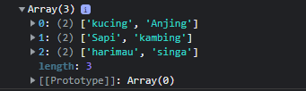
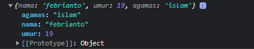
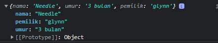
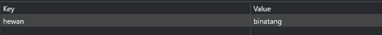

# Writing and Presentation week 3

## Js Intermediate **Array**

- Apa itu **Array**

     suatu tipe data terstruktur yang dapat menyimpan banyak data dengan suatu nama yang sama dan menempati tempat di memori yang berurutan serta bertipe data sama pula.
    
- Contoh **Array**
    ```js
    let data = ["nama", "umur", 20 ]
        console.log(data); // output 0: nama" 1: "umur" 2: 20
    ```

- mengakses **Array** dihitung dengan menggunakan index yang di mulai dari 0
    ```js
    let data = ["nama", "umur", 20 ]
        console.log(data[1]); // output : umur
    ```

- Ada beberapa properti pada **Array**  yaitu:

    - index
    - length
    - constructor
    - input
    - prototype

- contoh penggunaan properti length
    ```js
    let data = ["nama", "umur", 20 ]
        console.log(data.length);
    ```
    properti length mengembalikan jumlah panjang dari **Array**

- **Method Array** digunakan untuk manipulasi array, seperti menambah item baru, menghapus, dan sebagainya.

- Contoh **Method Array** 

    - `pop()` Digunakan untuk menambah satu atau lebih data baru
        ```js
        let buah = [
            'apel',
            'anggur',
            'jeruk'
        ]

        buah.push('pisang')
        console.log(buah) // output: 0: "apel" 1: "anggur" 2: "jeruk" 3: "pisang"
        ```
    - `pop` Digunakan untuk menghapus item terakhir Array
        ```js
        let buah = [
            'apel',
            'anggur',
            'jeruk'
        ]

        buah.pop()
        console.log(buah) // output: 0: "apel" 1: "anggur" 
        ```
    - `unshift()` Digunakan untuk menambah item baru diawal Array
        ```js
         let buah = [
            'apel',
            'anggur',
            'jeruk'
        ]

        buah.unshift('melon', 'pisang')
        console.log(buah) // output: 0: "melon" 1: "pisang" 2: "apel" 3: "anggur" 4: "jeruk"
        ```
    - `shift()` Digunakan untuk menghapus item pertama dari sebuah Array
        ```js
         let buah = [
            'apel',
            'anggur',
            'jeruk'
        ]

        buah.shift()
        console.log(buah) // output: 0: "anggur" 1: "jeruk" 
        ```
    - `slice()` Digunakan untuk memilih satu atau beberapa item dari sebuah Array.
        ```js
        let buah = [
            'apel',
            'anggur',
            'jeruk'
        ]

        buah.slice(0,2)
        console.log(buah) // output: 0: "anggur" 1: "jeruk" 
        ```


- Array **Multidimensional Array** adalah array yang berisi array tunggal atau banyak di dalamnya dan dapat diakses melalui beberapa indeks.

- Multidimensional Array bisa dianalogikan dengan array of array.

- Contoh **Array Multudimensional**

    ```js
    let hewan = [
        ["kucing", "Anjing"],
        ["Sapi", "kambing"],
        ["harimau", "singa"]
    ]
    console.log(hewan)
    ```
    Output

    


## JS Intermediate  **Object**

 - Object JavaScript adalah wadah untuk nilai yang diberi nama atau biasa disebut properti atau method.
 - Contoh sebuah **Object**
    
    ```js
    let data = {
        nama: "febrianto",
        umur: 19,
        agamas: "islam"
    }

    console.log(data)
    ```
    ouput
    

- Melakukan update pada variabel dengan tipe data **Object.**

    ```js
    let kucing = {
        nama: "Needle"
        umur: "3 bulan"
        pemilik: "febrianto"
    }

    kucing.pemilik = "glynn"

    console.log(kucing)
    ```
    output

    


## Js Intermediate **Recursive**

- Recursive adalah function yang memanggil dirinya sendiri sampai kondisi tertentu.

- Revursi memiliki 2 ciri yaitu selalu memiliki kondisi yang menyatakan kapan fungsi tersebut berhenti, dan **recursive** selalu memanggil dirinya sendiri sambil mengurangi atau memecahkan data masukan setiap panggilannya.

- Contoh kasus **Recursive** jika  ingin mendapatkan faktorial dari 10.

    ```js
    function factorial(hitung){
        let result = 1;

        for(let i = 2; i <= hitung; i++){
            result = result * i;
        }
        return result
    }

    console.log(factorial(10)) // output : 3628800
    ```


## JavaScript Intermediate **Asynchronous**

- Asynchronous sebuah teknik yang menyelesaikan fungsi secara bersamaan

- Salah satu function yang digunakan untuk mengatur penjadwalan asynchronous adalah ``setTimeout`` function

- Membuat asynchronous dengan beberapa cara yaitu :
    
    - ``Callback`` function adalah function yang kita letakan di dalam parameter pada function, dan function tersebut akan dieksekusi setelah function pertama menyelesaikan tugasnya.

        ```js
        const getMie= callback => {
            let Mie = null;

            console.log("Sedang memasak, silakan tunggu.")
    
            setTimeout(() => {
            Mie = "Mie silahkan di sajikan!";
            callback(Mie);
        }, 3000)
        }

            getMie(Mie => {
            console.log(Mie); 

            // output : Sedang memasak, silakan tunggu.
            // seteleah 3 detik : Mie silahkan di sajikan!
        })
        ```

    - ``Promises`` adalah salah satu fitur baru di ES6, biasa digunakan untuk melakukan http request/fetch data dari API.

    - Dalam pengambilan data, promise memiliki 3 kemungkinan state. Pending(sedang dalam proses, Fulfilled (berhasil) dan Rejected (gagal)

    - Contoh penggunaan ``Promises

        ```js
        let requstBundle = new Promise((resolve,   reject) => {
            if (false) {
            resolve("Permintaan anda di terima!")
        }
            reject("Permintaan anda di tolak")
        
        }).then(result => console.log(result))
        .catch(err => console.log(err))

        // output : Permintaan anda ditolak
        ```
    
    - `Async-Await` adalah salah satu fitur baru dari javascript yang digunakan untuk menangani hasil dari sebuah Promise. Sedangkan await berfungsi untuk menunda sebuah kode dijalankan sampai proses asynchronous berhasil.


## Js Intermediate **Web Storage**

- Dengan **web storage**, aplikasi web dapat menyimpan data secara lokal di dalam user browser.

- Sebenarnya **Web Storage** ini sama halnya seperti Cookie, Datanya akan tersimpan didalam web browser tapi memiliki beberapa kelebihan yaitu dapat menyimpan data lebih aman dan lebih besar dibandingkan dengan cookie,

- **Web storage** ada dua jenis yaitu localStorage dan sessionStorage
- LocalStorage digunakan untuk menyimpan data pada browser dan data akan tetap tersimpan walaupun browser ditutup
- sessionStorage digunakan untuk menyimpan data pada browser hanya pada satu sesi dan data akan dihapus ketika browser ditutup

- Contoh penggunaan LocalStorage

    ```js
    localStorage.setItem('hewan', 'binatang' )
    ```
    output

    

- Property dan method yang digunakan pada localStorage dan sessionStorage yaitu: 
  
    - `key(n)` Mendapatkan nama key atau nama data urutan ke-n pada penyimpanan dimulai dari 0.
    - `length` Mendapatkan jumlah item data yang disimpan pada storage
    - `getItem(nama_key)` Mendapatkan data dari storage dengan nama yang disebutkan
    - `setItem(nama_key, data_disimpan)` Menyimpan data ke storage
    - `removeItem(nama_key)`  Menghapus data pada storage dengan nama yang disebutkan
    - `clear()` Mengosongkan semua data tersimpan pada storage


