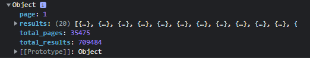

# Writing and Presentation Test

## **JavaScript Intermediate - Asynchronous - Fetch**

- **Fetch** adalah native web API untuk melakukan HTTP calls dari external network.
- **Fetch** ini di gunakan untuk mengambil data dan menampilkan data ke browser.
- Contoh function untuk mengambil data dari API menggunakan fetch(), Dengan Async Await

    ```js
    let getDataDigimon = async() =>{
        let response = await fetch("https://api.themoviedb.org/3/discover/movie?sort_by=popularity.desc&api_key=a778f608cc2da52edfa63af16f8ebbc2")
         et result  = await response.json()
        console.log(result)
    }
    getDataDigimon()
    ```
    Outputt

    

## **JavaScript Intermdiate - Asynchronous - Async Await**

- **Async/await** adalah fitur yang hadir sejak ES2017, fitur ini mempermudah kita dalam menangani proses asynchronous.
- Async/Await adalah salah satu cara untuk mengatasai masalah asynchronous pada Javascript selain menggunakan callback dan promise.
- Penggunaan **Async/Await

    ```js
    const getAllUser = async ()=> {
	    try {
		    const result = await getUser()
		    console.log(result)
	    } catch (error) {
		    console.log(error)
	        }
        }  
    getAllUser()
    ```
    Penjelasan
     - ``async`` mengubah function menjadi asynchronous
     - ``await``  menunda eksekusi hingga proses asynchronous selesai, dari kode di atas berarti console.log(result) tidak akan di eksekusi sebelum prose getUSer() selesai.

## **Git & Github Lanjutan**

- ``Git Branch`` Sebuah cabang bagian dari main repository master branch yang memiliki history yang berbeda dengan master dan bisa di jadikan satu dengan master atau main branch

    - Membuat branch baru

        ```
        git branch namabranch
        ```
    - Pindah branch

        ```
        git checkout master
        ```

- ``Git Merge`` untuk membuat branch yang bercabang menjadi satu kembali

- ``Pull request`` permintaan untuk menggabungkan (merge) kode yang kita modifikasi dengan repositori utama atau repositori lain

- Contoh tahapan kolaborasi 

    - Clone repositori
    - Membuat branch misal dengan perintah git checkout -b dev
    - Melakukan penambahan atau perubahan di branch dev
    - Commit dan push ke branch dev
    - Membuat permintaan pull request


## **Responsive Web Design**

- **Responsive web** design adalah sebuah teknik atau metode untuk membuat suatu layout website yang dapat menyesuaikan diri sesuai dengan ukuran layar pengguna.
- Semuanya aspek dari desain website mulai dari user interface, image, font, video akan menyesuaikan dengan resolusi device pengguna.

- Syarat Website Responsive

    - Layout dan Tata Letak
    - Media
    - Typography

- Membuat Web Responsive

    - Mendefinisikan Tag Meta Viewport
        
        ```html
        <meta name="viewport" content="width=device-width, initial-scale=1.0">
        ```
    - **Media Query** memungkinkan website untuk dapat mengambil data mengenai ukuran layar yang digunakan untuk menampilkan konten.

        ```css
        @media only screen and (max-width: 1000px) {
            body {
            background-color: yellow;
            }
        }
        ```
        Code diatas akan memerintahkan browser, ketika lebar layar berukuran 1000px atau kurang dari itu, maka tampilan background browser berwarna kuning, ketika lebih dari itu maka tampilan akan berubah
    - Jenis Media Query untuk responsive web design umumnya hanya menggunakan 2 jenis media query yaitu main-width dan mas-width.

- **Flexbox**  merupakan sebuah mode pengaturan atau konsep layout pada CSS yang digunakan untuk mengatur elemen atau container beserta item didalamnya pada halaman web.
- **Flexbox** bertjujuan untuk memberikan container kemampuan untuk mengatur panjang, lebar, dan posisi item-item yang berada di dalamnya agar memaksimalkan ruang yang ada.
- **Flexbox** mempunyai sistem koordinat sendiri, yaitu

    - ``Main Axis``  garis horizontal yang membentang dari kiri ke kanan (default)
    - ``Cross Axis``  garis vertikal yang membentang dari atas ke bawah (default)

- Properti-properti Flexbox

    - **align-content** Properti ini mendefinisikan bagaimana setiap baris sejajar dalam flexbox container.
    - flex-direction

        Menentukkan arah (direction) yang akan diberlakukan untuk item-item yang ada pada container flexbox.

        ```css
        .container {
            flex-direction: column; /* Pilihan valuenya ada:  row | row-reserve | column | column-reserve */
        }
        ```

    - flex-wrap

        flex-wrap digunakan untuk mendefinisikan bahwa elemen item di dalam container flexbox tidak harus disejajarkan dalam satu baris.
        
        ```css
        .container {
            flex-flow: row wrap; /* Penjelasannya:  <flex-direction> spasi <flex-wrap> */
        }
        ```

    - justify-content

        justify-content digunakan untuk mensejajarkan item-item diantara flexbox.
        ```css
        .container {
            justify-content: space-arround; /* Pilihan valuenya ada:  flex-start | flex-end | center | space-between | space-arround | baseline */
        }
        ```
    - align-items mendefinisikan bagaimana item-item pada container flex tersebut diletakkan sepanjang garis tegak lurus pada sumbu utama (cross-axis).
      ```css
      .container {
            align-items: flex-end; /* Pilihan valuenya ada:  flex-start | flex-end | center | baseline | stretch*/ 
        }
        ```
    
    - align-content digunakan untuk mensejajarkan garis flex container ketika ada ruang kosong secara garis tegak lurus pada sumbu utama (cross-axis).

        ```css
        .container {
        justify-content: space-arround; /* Pilihan  valuenya ada:  flex-start | flex-end | center | space-between | space-arround | baseline */
        }
        ```

- **Grid** adalah CSS yang dapat membagi kolom pada website menjadi beberapa bagian sesuai yang diinginkan, baik secara horizontal maupun vertikal.

- **Grid** bertujuan untuk mempermudah developer untuk membuat layout dari design yang telah dibuat.


## **Bootstrap 5**

- Bootstrap adalah sebuah framework HTML, CSS, dan JavaScript yang berfokus untuk menyederhanakan pengembangan halaman web atau website.

- Pada umumnya, Bootstrap digunakan untuk mengimplementasikan berbagai pilihan warna, ukuran, font, dan layout yang ada dalam framework tersebut ke dalam sebuah website.

- Komponen Bootstrap sebagian besar dibangun dengan base-modifier nomenclature. Contohnya mengelompokkan beberapa properti kedalam kelas dasar seperti .btn, seperti .btn-primary or .btn-success.

- Grid System pada bootstrap yang terdiri dari 12 kolom default.

- Grid system pada bootstrap menggunakan container,baris dan kolom untuk menata dan menyelaraskan konten,yang dibangun menggunakan flexbox dan itu sudah responsive.

- Contoh penggunaan Grid system
    
    ```html
    <div class="container text-center">
        <div class="row">
            <div class="col">
                Column
            </div>
            <div class="col">
                Column
            </div>
            <div class="col">
            Column
            </div>
        </div>
    </div>
    ```
    Ouput

    


