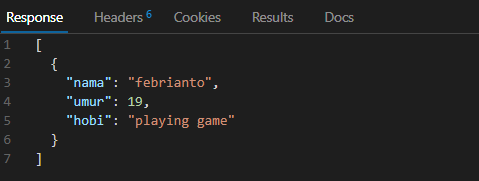

# Wrinting & Presentation Week 5

## Web Server & RESTful API

-   **Web Server** adalah sebuah software (perangkat lunak) yang memberikan layanan berupa data.
- **Web Server** berfungsi menerima permintaan HTTP atau HTTPS dari klien atau kita kenal dengan web browser (Chrome, Firefox). Ia juga akan mengirimkan respon atas permintaan kepada client dalam bentuk halaman web yang umumnya HTML.
-   Web server terdiri dari 2 komponen penting:

    -   Hardware Disisi ini **Web Server** adalah komputer yang menyimpan perangkat lunak server web dan file komponen situs web.
    -   Software **web server** mencakup beberapa bagian yang mengontrol cara pengguna web mengakses file yang dihosting.

-   **Server Side** Web Server menunggu pesan permintaan klien, memprosesnya saat tiba, dan membalas browser web dengan pesan respons HTTP. Tanggapan berisi baris status yang menunjukkan apakah permintaan berhasil atau tidak

-   **REST API** merupakan salah satu dari desain arsitektur yang terdapat di dalam API itu sendiri.

-   Cara kerja dari **RESTful API** yaitu REST client akan Melakukan akses pada data/resource pada REST server dimana masing-masing resource. Atau data/resource tersebut akan dibedakan oleh sebuah global ID atau URIs (Universal Resource Identifiers). 

-   Jadi, Nantinya data yang diberikan oleh REST server itu bisa berupa format text, JSON atau XML. Dan saat ini format yang paling populer dan paling banyak digunakan adalah format JSON.

-   Metode HTTP yang secara umum dipakai dalam **REST api** adalah sebagai betikut :

    -   ``GET`` berfungsi untuk membaca data/resource dari REST server
    -   ``POST`` berfungsi untuk membuat sebuah data/resource baru di REST server
    -   ``PUT`` berfungsi untuk memperbaharui data/resource di REST server
    -   ``DELETE`` berfungsi untuk menghapus data/resource dari REST serve
    -   ``PATCH`` metode ini hampir sama dengan PUT Namun terdapat sedikit perbedaan yaitu PATCH hanya melakukan pembaruan beberapa field dalam sebuah record dan tidak semua field seperti PUT.


-   Apa itu HTTP Status Code?

    HTTP status adalah jawaban server website atas permintaan data oleh browser

    - ``HTTP Status Code 100-an``Kode memberitahukan informasi bahwa permintaan dari browser masih diproses karena suatu hal 
    - ``HTTP Status Code 200-an`` Kode yang berarti bahwa permintaan browser telah berhasil diterima, dipahami, dan diproses oleh server. 
    - ``HTTP Status Code 300-an`` Kode ini adalah kode redirect. 
    - ``HTTP Status Code 400-an`` Kode di kategori ini menunjukan adanya error dari sisi web browser.
    - ``HTTP Status Code 500-an``Kode menunjukkan adanya error dari server.

## Intro Node JS
 -  NodeJS merupakan runtime environment untuk JavaScript yang bersifat open source dan cross platform untuk mengeksekusi kode JavaScript di sisi server sebelum ditampilkan di browser.

 -  Build In Module Node JS

    Nodejs memiliki banyak modul bawaan (build-in) yang bisa kita manfaatkan dalam membuat program antara lain sebagai berikut :

    Untuk mengimpor modul build-in ke dalam programadalah menggunakan fungsi require().

    -   ``Process`` adalah modules yang digunakan untuk menampilkan dan mengontrol prosess Node JS yang sedang dijalankan.

        ```js
        const process = require('process')
        const env = process.env

        env.foo = "hello febrianto"
        console.log(env.foo);

        // output : hello febrianto
        ```
    
    -   ``OS`` module merupakan module yang digunakan untuk menyediakan informasi terkait sistem operasi komputer yang digunakan user.
        ```js
        const os = require('os')

        console.log( os.platform())
        console.log(os.release())

        // output : win32 10.0.19042
        ```
    
    -   Create server ``http`` untuk melakukan HTTP Request dan membuat server HTTP 
        ```js
        const http = require('http')

        http.createServer((req, res) =>{
            res.write("hello febrianto")
             res.end()
            })

        .listen(8000)
        ```


## Express JS

-   **Express.js** adalah framework back end. Artinya, ia bertanggung jawab untuk mengatur fungsionalitas website, seperti pengelolaan routing dan session, permintaan HTTP, penanganan error, serta pertukaran data di server. 

-   Cara kerja **Express JS** adalah sebagai berikut :

    -   Routing

        Routing adalah metode yang digunakan website (server) untuk merespons permintaan dari browser (client). Misalnya, permintaan untuk menampilkan halaman tertentu. 
        
        Cara kerja routing di Express.js adalah dengan sebuah metode bernama app. Metode tersebut akan merespons setiap permintaan berbentuk HTTP. Misalnya GET, POST, PUT, dan DELETE.

        contoh penggunaan
        ```js
        const express = require('express')

        const app = express()

        const users = [
            {
                nama: "febrianto",
                umur: 19,
                hobi: "playing game"
            }
        ]

        app.get('/users', (req, res) =>{
        res.send(users)
        })
        app.listen(8080)
        ```
        output response
        
    
    -   Express Middleware

        Middleware function adalah sebuah fungsi yang memiliki akses ke object request (req), object response (res), dan sebuah fungsi next didalam request-response cycle.

    -    Cara kerja Midleware
    Middleware function menentukan bahwa suatu HTTP Request adalah request yang buruk dan salah, maka middleware function memiliki kemampuan untuk menghentikan request-response cycle.
    Berlaku juga sebaliknya, jika middleware function menentukan suatu HTTP Request baik dan benar, maka middleware function memiliki kemampuan untuk melanjutkan request-response cycle ke proses selanjutnya.

    - 


