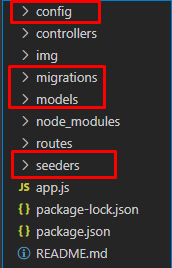
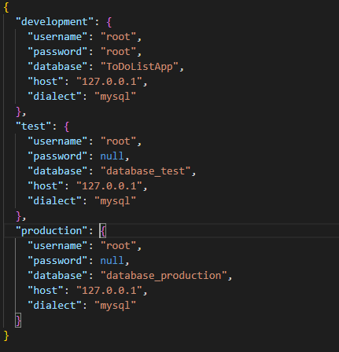
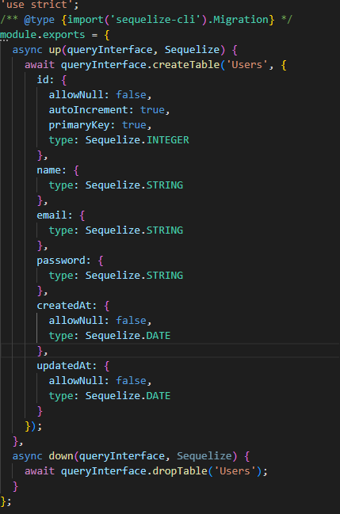
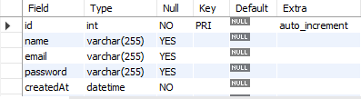
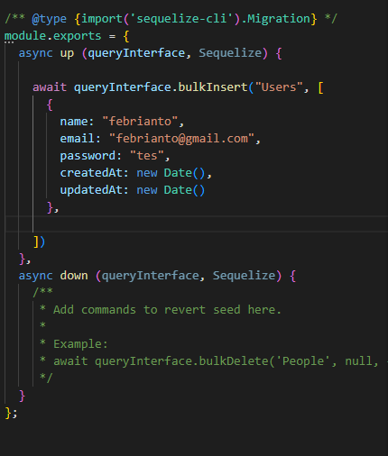
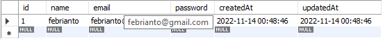

# Writing Test Week 3 Back-End Bootcamp

## 	Sequelize

-   **Sequelize** adalah Node.js promise-based ORM untuk MySQL, PostgreSQL, SQLite, MSSQL dan database SQL lainnya.

-   **Sequelize** berfungsi  untuk bekerja dengan database dan relasi-relasi di dalamnya. Sehingga pada saat deployment tidak perlu melakukan perubahan konteks saat menuliskan kode karena sudah membuat interaksi menggunakan bahasa Javascript melalui api yang sudah disediakan oleh Sequelize.

-   Apa itu ORM?

    ORM (Object Relation Mapping) merupakan teknik yang merubah suatu table menjadi sebuah object yang nantinya mudah untuk digunakan. Object yang dibuat memiliki property yang sama dengan field yang ada pada table tersebut.

    ORM memungkinkan kita melakukan query dan memanipulasi data di database menggunakan object oriented.

-   Penggunaan Sequlize

    - Install sequelize dengan menggunakan kode ``npm install sequelize``

    - Kemudian install libary MySql ``npm install mysql2``

    - Menggunakan Migration dengan cara install ``npm install -D sequelize-cli``

    - Menginialsisai project dengan kode ``npx sequelize-cli init`` kode akan menambahkan folder config, migration, models dan seeder

        

    - pada folder config untuk settingan database

        

         Jika database belum dibuat kita bisa membuatnya sesuai dengan konfigurasi menggunakan kode ``npx sequelize-cli db:create``

    - Kemudian membuat model, models sendiri adalah representasi dari tabel dengan menggunakan perintah ``model:create`` ``npx sequelize-cli model:create --name User --attributes name:string,email:string,password:string``

        - ``--name: `` sebuah nama modelnya atau tabel
        - ``--attributes`` merupakan list tabel 


    - Setelah menjalankan perintah diatas akan otomatis menambahkan file pada folder models dan migration menyimpan perubahan pada tabel,  pada migration akan menjalakan sebuah perintah create table dan drop tabel seperti pada gambar dibawah ini

        


    - Sampai tahap ini belum menginputkan data pada database, untuk menginput bisa menggunakan ``db:migrate`` ia akan menjalankan async up ``npx sequelize db:migrate``

        

        Jika ingin menghapus tabel tersebut bisa menggunakan ``db:migrate:undo``

    - Selanjutnya membuat data awal pada file seeder, dengan menggunakan ``seed:create`` ``npx sequelize seed:create --name User``, akan muncul file pada foler seeder seperti pada gambar dibawah ini

        

    - Untuk menginputkan data menggunakan query yaitu ``bulkInsert()``, lalu untuk menjalankan perintah yang ada pada seeder bisa menggunakan`` npx sequelize db:seed --seed 20221113075559-user.js``

        


## MongoDB

- **MongoDB** adalah salah satu jenis database NoSQL yang cukup populer digunakan.  Berbeda dengan database jenis SQL yang menyimpan data menggunakan relasi tabel, MongoDB menggunakan dokumen dengan format JSON.

- **NoSQL** adalah singkatan dari Not Only SQL. Database management system ini bersifat tanpa relasi.  

- **NoSQL** bisa mengelola database dengan skema yang fleksibel dan tidak membutuhkan query yang kompleks.

- Sistem database mongoDB ini menggunakan beberapa komponen penting, yaitu antara lain sebagai berikut: 

    - ``Database`` – merupakan wadah dengan struktur penyimpanan yang disebut collection. 
    - ``Collection`` – merupakan tempat kumpulan informasi data yang berbentuk dokumen. Collection dipadankan seperti tabel-tabel yang berisi data pada database SQL.  
    - ``Document`` – merupakan satuan unit terkecil dalam MongoDB. 

- Contoh data pada **mongodb**
    ```js
    {
        "_id": "5cf0029caff50556591b0ce7d",
        "firstname": "Febrianto",
        "lastname": "Manangi",
        "address": {
            "street": "Jl Garuda",
            "city": "Kota Palu ",

        },
        "hobbies": ["Playing Game", "study"]
    }
    ```


## Mongoose

- **Mongoose** adalah sebuah module pada NodeJS yang di install menggunakan npm, berfungsi sebagai penghubung antara NodeJS dan database nosql MongoDB.

- **Mongoose** menyediakan feature diantaranya, model data application berbasis Schema. Dan juga termasuk built-in type casting, validation, query building, business logic hooks dan masih banyak lagi yang menjadi ke andalan mongoose.


- Penggunaan **Monggose **

    - Installasi **Mongoose**
    
        
            npm install mongoose
    
    - Koneksi ke database MongoDB

        ```js
        const mongoose = require('mongoose')
        require('dotenv').config()

        const url = process.env.MONGOOSE_URL


        const db = mongoose.connection
        db.on('error', console.error.bind(console, 'connection error:'));
        db.once('open', function() { 
            console.log('connection success'); 
        });
        ```

    - Membuat schema 

        ```js
        const mobilSchema = mongoose.Schema({ 
            nama: String, 
            merk: String, 
            tahunPembuatan: Number, 
            tanggalUpdate: Date, 
            transmisi: { 
                manual: Boolean, 
                outomatic: Boolean 
            } 
        });

        const Mobil = mongoose.model('Mobil', mobilSchema);
        ```
        Nantinya collection kita akan bernama mobils, yang di ambil Mobil dari parameter pertama function model.

- MongoDB dan Mongoose dapat mendukung type data, String, Number, Date, Buffer, Boolean, Mixed, ObjectId, dan Array.

        
## Docker

- Docker adalah layanan yang menyediakan kemampuan untuk mengemas dan menjalankan sebuah aplikasi dalam sebuah lingkungan terisolasi yang disebut dengan container. 

- Dengan adanya isolasi dan keamanan yang memadai memungkinkan kamu untuk menjalankan banyak container di waktu yang bersamaan pada host tertentu.

- Kelebihan

    Dalam penggunaannya, docker memiliki beragam manfaat atau kelebihan yang menjadikannya populer di kalangan developer. Berikut ini adalah beberapa kelebihannya.

    - Memiliki konfigurasi yang sederhana
    - Tingkat keamanan yang baik
    - Dapat dijalankan pada beberapa platform cloud
    - Dapat melakukan debugging
    - Dapat digunakan pada berbagai sistem operasi

- Docker terdiri dari empat komponen utama, yaitu antara lain sebagai berikut : 
    - ``Client Docker`` komponen utama untuk membuat, mengelola, dan menjalankan aplikasi dalam container. C
    - ``Server Docker`` juga disebut daemon Docker. Server Docker menunggu permintaan REST API yang dibuat oleh client Docker serta mengelola image dan container.
    - ``Image Docker`` komponen yang memerintahkan server Docker terkait persyaratan tentang cara container Docker dibuat. 
    - ``Registry Docker`` – aplikasi sisi server open-source yang digunakan untuk menghosting dan mendistribusikan image Docker. 

- Perintah Dasar

    - ``docker pull`` Download image dari docker hub
    - ``docker images`` Melihat kumpulan images yang sudah terdownload
    - ``docker run`` Digunakan untuk menjalankan container


    

        