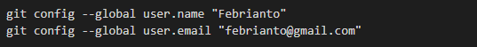
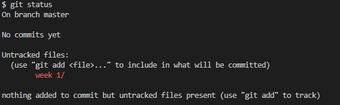
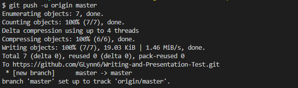
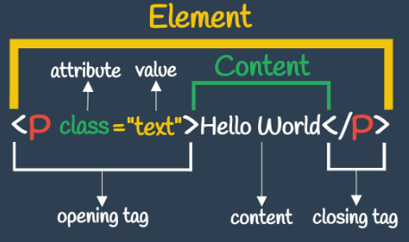
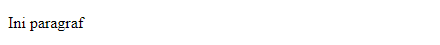
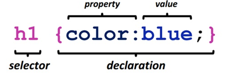
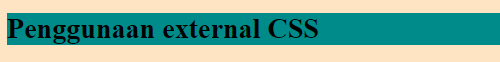
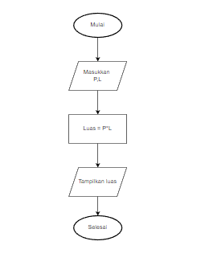

# Writing and Presentation Test - Week 1
## Unix Command Line

- CLI (Command Line Interface) 
    
    Adalah baris perintah yang dituliskan oleh user untuk menjalankan suatu instruksi pada sistem operasi yang dilakukan di terminal. CLI merupakan shell yang berbasis teks 

- Shell 

    Shell adalah sebuah program atau     penterjemah perintah yang menjembatani user dengan sistem operasi, dimana user dapat mengetikkan perintah-perintah kemudian diteruskan oleh shell lalu di eksekusi oleh system 


     Selain CLI shell juga ada yang berbasis GUI (Graphical User Interface). Ada beberapa macam GUI & CLI antara lain yaitu :

    Graphical User Interface 

    - Windows
    - Mac OS
    - Ubuntu
    
    &nbsp;

    Command Line Interface
    - Sh
    - Bash
    - Cmd.exe

  &nbsp;

 - Filesystem

    File System merupakan struktur logika yang digunakan untuk mengendalikan akses terhadap data yang ada pada disk. Contoh dalam Sistem Operasi Windows struktur file yang disimpan menggunakan struktur yang bentuknya mirip sebuah pohon seperti gambar dibawah. 

     

      &nbsp;

- Command 
    
    Command untuk melakukan navigasi :

    - pwd - mencari path dari direktori (folder) yang digunakan saat ini.
    - ls - untuk melihat isi file yang ada disebuah direktori.
   - cd <..directory..>  - untuk berpindah  direktori.


    &nbsp;
    
    Command untuk memanipulasi file dan direktori :
    - touch - untuk membuat sebuah file 
    - mkdir - untuk membuat sebuah direktori 
    - head - untuk melihat beberapa line awal dari sebuah file text 
    - tail - untuk melihat beberapa line awal dari sebuah file text 
    - cp - untuk mengcopy files atau directory 
    - mv - untuk memindahkan files atau directory. Bisa digunakan untuk rename.
    -  rm - untuk menghapus file atau directory 
    - cat - untuk melihat isi sebuah file 
    - cat - untuk melihat isi sebuah file 

&nbsp;

 ## Git & Github

- Pengertian Git 

    Git merupakan software berbasis Version Control System (VCS) yang bertugas untuk mencatat perubahan seluruh file atau repository suatu project. 

- Version Control System (VCS) 

    VCS adalah sebuah sistem yang melakukan source code management (SCM) )untuk mengelola perubahan di setiap dokumen, program komputer, website, dan kumpulan pemrograman lainnya. 
- Github

    GitHub adalah website yang digunakan untuk menyimpan dan mengelola kode suatu project. 

&nbsp;

- Command Git 

    - Setup Awal <br>
        Menentukan nama pengguna dan alamat email untuk informasi commit nantinya

        
    
    - git init <br>
        git init digunakan untuk membuat repository di file
    
    - git status <br>
        git status digunakan untuk mengetahui sebuah status dari sebuah repository lokal

        
    
    - git add <br>
        Perintah yang digunakan untuk menambahkan file baru di repository yang dipilih dengan menggunakan code "git add ." atau  "git add nama file" <br>

        

    - git push 
        git push digunakan dalam mengirimkan perubahan file yang dilakukan setelah di commit ke remote repository

        

&nbsp;

## HTML

- Apa itu HTML 

    Hypertext Markup Language adalah bahasa markup standar untuk dokumen yang dirancang untuk ditampilkan dihalaman website.

    HTML bukanlah sebuah bahasa pemrograman, artinya HTML tidak bisa dinamis mengolah data.

   <br>

- Struktur HTML

    HTML memikiliki sebuah struktur dasar yaitu sebagai berikut :

    ```html
    <html>
        <head>
            <title>Judul Website </title>
        </head>

        <body>
            Hi.. I'am Febrianto
        </body>

    </html>
    ```

    Setiap halaman HTML sudah pasti mempunyai struktur dasar yang terdiri dari : tag html, tag head, dan tag body. Ini lah struktur dasar dari HTML. Tag head umumnya berisi elemen yang tidak tampak pada browser seperti judul website, tag body sebaliknya, berisi elemen yang akan tampak pada browser. Seperti paragraf, memasukkan gambar, dan lain-lain.

    <br>

- Anatomy HTML

    Tiga istilah utama ketika menulis HTML. Ketiga istilah tersebut ialah elemen, tag, dan atribut.
    
    <br>

- Element HTML 

    HTML Element merupakan sebuah komponen dalam halaman web, bisa berupa paragraf, judul, atau gambar. Struktur dari sebuah HTML element dapat digambarkan seperti ini :

    

    <br>

- Tag HTML

    Tag adalah suatu tanda pengenal dokumen pada html yang terdiri 2 bagian yaitu tag pembuka contoh dan tag penutup  Tag dibuat dengan kurung siku <...>, lalu di dalamnya terdapat nama tag dan kadang juga ditambahkan dengan atribut. Tag menandakan akhir terdapat sebuah tanda "/". 
    
    <br>

    Ada beberapa contoh tag sebagai berikut  :

    - Membuat Heading

        ``` html 
        <h1> Hi... I'am Febrianto </h1>
        ```

        hasil pada browser

         

        <br>
    
    - Membuat Paragraf

        ``` html
        <p> Ini paragraf </p>
        ```

        tampilan pada browser

        

        <br>
    
    - Membuat  link pada halaman web

        ``` html
        <a href= "https://skilvul.com/">Skilvul</a>
        ```

        tampilan pada browser

        

        <br>

    - Membuat huruf tebal dan miring

        ```html
        <b>Ini tulisan tebal</b> 
        
        <i>Ini tulisan miring </i>
        ```

        tampilan pada browser

        

    <br>

    - Manampilkan gambar
        
        ```html
        
        ```

        tampilan pada browser

        
   
&nbsp;

- Attribut HTML

    Attribute adalah properties dari sebuah HTML Element. Semua HTML Element memiliki attribute. Di dalam Opening Tag dapat berisi attribute, yang berfungsi untuk memberikan informasi tambahan kepada sebuah element.

    Contoh penggunaan attribute :
    ``` html
    
    ```

    Pada kode di atas, tag  memiliki dua attribute:

    - width yang berfungsi untuk menentukan lebar dari element gambar, dan diberikan value (nilai) lebar sebesar 80%
    -   src yang berfungsi untuk menentukan sumber gambar, dan diberikan value (nilai) untuk diarahkan ke tautan.

<br>

- Semantic HTML

    HTML semantik adalah penggunaan markup HTML untuk memperkuat semantik, atau makna, dari informasi dalam halaman web dan aplikasi web bukan hanya untuk menentukan presentasi atau melihat.

&nbsp;

## CSS 

- Apa itu CSS 

    CSS adalah singkatan dari cascading style sheets, yaitu bahasa yang digunakan untuk menentukan tampilan dan format halaman website. Dengan CSS, bisa mengatur jenis font, warna tulisan, dan latar belakang halaman.

    <br>

- Structur CSS

    Struktur kode CSS terdiri dari tiga bagian yaitu Selektor, Blok Deklarasi Properti dan value.

    

<br>

- Penggunaan CSS

    Ada 3 cara untuk menyisipkan CSS ke dalam HTML, yaitu :
    
    - Inline CSS

        Inline CSS menggunakan attribute style untuk menyisipkan kode CSS langsung di dalam HTML element.

        ```html
        <h3 style="color:blue;"> Hi... I'am Febrianto </h3>
        ```

        tampilan pada browser

        

    <br>

    - Internal CSS

        Internal CSS menggunakan element (<..style..>) untuk menyisipkan kode CSS. Element (<..style..>) tersebut diletakkan di dalam element (<..head..>).

        ```html
        <html lang="en">
            <head>
                <title>Document</title>
                <style>
                    body {
                        background-color: deepskyblue;
                    }
                    h3{
                    background-color: yellow;
                }

                </style>
            </head>
            <body>
                <h3> Hi... I'am Febrianto </h3>
            </body>
        </html>
        ```

        tampilan pada browser

        

        <br>

    - External CSS

        External CSS adalah sebuah file CSS terpisah yang disambungkan dengan file HTML dengan menggunakan element (<..link..>).

        ``` html
        <!-- file index.html -->

        <html lang="en">
            <head>
                <title>Document</title>
                <<link rel="stylesheet" href="style.css" />
            </head>
            <body>
                <h3> Penggunaan external CSS </h3>
            </body>
        </html>
        ```
        ```css
        /* file syless.html */

        body   {
                background-color: bisque;
        }

        h3 {
            background-color: darkcyan;

        }
        ```

        tampilan pada browser

        
        
    <br>

- Penggunaan Flexbox

    Flexbox digunakan untuk mengatur elemen di suatu halaman web. Flexbox ini akan mengatur ukuran dari elemen anaknya secara otomatis, dan mampu beradaptasi dengan ukuran container-nya.

- Property Container Flexbox 

    Ada beberapa property Flexbox antara lain sebagai berikut :

    - flex-direction

        Menentukkan arah (direction) yang akan diberlakukan untuk item-item yang ada pada container flexbox.

        ```css
        .container {
            flex-direction: column; /* Pilihan valuenya ada:  row | row-reserve | column | column-reserve */
        }
        ```

    - flex-wrap

        flex-wrap digunakan untuk mendefinisikan bahwa elemen item di dalam container flexbox tidak harus disejajarkan dalam satu baris.
        
        ```css
        .container {
            flex-flow: row wrap; /* Penjelasannya:  <flex-direction> spasi <flex-wrap> */
        }
        ```

    - justify-content

        justify-content digunakan untuk mensejajarkan item-item diantara flexbox.
        ```css
        .container {
            justify-content: space-arround; /* Pilihan valuenya ada:  flex-start | flex-end | center | space-between | space-arround | baseline */
        }
        ```
    - align-items mendefinisikan bagaimana item-item pada container flex tersebut diletakkan sepanjang garis tegak lurus pada sumbu utama (cross-axis).
      ```css
      .container {
            align-items: flex-end; /* Pilihan valuenya ada:  flex-start | flex-end | center | baseline | stretch*/ 
        }
        ```
    
    - align-content digunakan untuk mensejajarkan garis flex container ketika ada ruang kosong secara garis tegak lurus pada sumbu utama (cross-axis).

        ```css
        .container {
        justify-content: space-arround; /* Pilihan  valuenya ada:  flex-start | flex-end | center | space-between | space-arround | baseline */
        }
        ```
    
 
        
&nbsp;

## Algortima dan Struktur Data

-  Apa itu Algortima

    Algoritma adalah metode atau langkah yang direncanakan secara tersusun dan berurutan untuk menyelesaikan atau memecahkan permasalahan dengan sebuah intruksi.

<br>

- Pentingnya Algoritma

    Pentingnya algoritma disini adalah agar pengerjaan suatu program dapat dilakukan dengan runtut dan rapi. Bisa saat kita membuat program terlebih dahulu tapi hal tersebut dapat dipastikan, dalam pengerjaannya, akan tersendat-sendat. Hal itu dikarenakan dalam proses pembuatan program, seorang programmer akan membayangkan / menghayal bagaimana aplikasi yang dibuat nantinya.

<br>

- Ciri - Ciri Algoritma

    Algoritma pemrograman mempunyai ciri tersendiri yang dapat membedakannya dengan teknik pemrograman  berikut di antaranya sebagai berikut :

    - Input (Masukan) -  memiliki  nol atau lebih masukan (input).
    - Output (Keluaran) - mempunyai minimal satu keluaran (output).
    - Definiteness (Kepastian) - harus jelas dan sesuai dengan tujuan.
    - Finiteness (Keterbatasan) - harus berakhir setelah mengerjakan sejumlah langkah proses.
    - Effectiveness (Keefektivitasan) - tepat sasaran dan efisien.

<br>

- Penyajian Algoritma

    Algoritma dapat ditulis dengan berbagai cara antara lain yaitu Deskriptif, Flow Chart dan Pseudo Code.

    - Algoritma Deskriptif 

        Penulisan algoritma dengan cara deskriptif seperti menulis tutorial (tata cara) dengan bahasa sehari-hari. Contoh Algoritma dalam luas persegi panjang :

        - Masukan lebar dan panjang persegi panjang.
        - Lakukan operasi perkalian antara panjang dan lebar persegi panjang.
        - Hasil perkalian merupakan luas dari persegi panjang.
        - Tampilkan luas persegi panjang.

    <br>

    - Algoritma Flow Chart

        Flowchart atau bagan alur adalah diagram yang menampilkan langkah-langkah dan keputusan untuk melakukan sebuah proses dari suatu program. Setiap langkah digambarkan dalam bentuk diagram dan dihubungkan dengan garis atau arah panah.

        

        <br>

    - Algoritma Peseudo Code

        Pseudocode adalah menuliskan algoritma dengan umumnya bahasa inggris sebelum kita implementasikan ke bahasa pemograman tertentu.

       Ada beberapa panduan dalam menulis pseudocode antara lain sebagai berikut : 
       
        - Menggunakan HURUF BESAR pada kata kunci (key commands).
        - 1 statement =  1 baris 
        - Menggunakan indentasi 
        - Please please be specific
        - Tetap simpel

        <br>

        Contoh Pseudo code
        ```md
        PROGRAM HitungLuasPersegiPanjang

        DEKLARASI

        let panjang,lebar;luas:integer;

        ALGORITMA

        read (panjang) ;

        read (lebar) ;

        luas<-- panjang * lebar;

        write (luas) ;
    
    <br>

    - Pseudocode berdasarkan kondisi masalah

        - Procedural

            Procedural adalah cara berpikir secara runtun. Artinya serangkaian perintah yang berurutan.

            ```md
            PROGRAM HitungLuasPersegiPanjang
            DEKLARASI
            let panjang,lebar;luas:integer;
            ALGORITMA
            read (panjang) ;
            read (lebar) ;
            luas<-- panjang * lebar;
            write (luas) ;
            ```

        <br>

        - Conditional

            Conditional digunakan saat dibutuhkan percabangan kasus. Komputer akan melakukan suatu tindakan jika suatu kondisi terpenuhi. 
            ```md
            READ bilangan
            IF(bilanagan modulus 2 = 0) THEN
                DISPLAY "genap"
            ELSE
                DISPLAY "ganjil"
            ENDIF
            ```
        
        <br>

        - Looping

            Komputer dapat melakukan sebuah proses yang sama berulang-ulang. Jika membutuhkan perulangan dalam kasus tertentu, kita bisa menggunakan Looping.

            ```md
            Menampilkan angka dari 5 hingga 1
            Deklarasi
            hitung = integer
            BEGIN
                FOR (hitung ← 5 ; hitung > 0 ; bilangan-- )
                DISPLAY ('hitung')         
            ENDFOR
            END
            ```

            <br>

    - Big O Notation

        Big O adalah sebuah metrik yang digunakan untuk mengukur kompleksitas suatu algoritma. Kompleksitas dalam konteks ini berkaitan dengan efisiensi kode. Semakin rendah kompleksitasnya, semakin efisien pula kode tersebut.

&nbsp;

# Intro JavaScript

- Apa itu JavaScript

    Javascript adalah bahasa pemograman yang sangat powerful yang digunakan untuk logic pada sebuah website.

<br>

- Penggunaan JavaScript

    Ada dua cara penggunaan JavaScript, antara lain sebagai berikut :

    -  Internal JavaScript, yaitu menyisipkan kode JavaScript langsung di dalam file HTML.
    
        ```html
        <!-- <script> tag di dalam <head> -->
        <!DOCTYPE html>
        <html lang="en">
            <head>
                <title>Document</title>
                <script> console.log("Penggunaan intrenal JS"); // output : Penggunaan intrenal JS 
                </script>
            </head>
            <body>
                
            </body>
        </html>
        ```
    - External JavaScript, yaitu membuat file JavaScript sendiri dan menyambungkannya dengan file HTML.

        ```html
        <!-- file index.html -->
        <!DOCTYPE html>
        <html lang="en">
            <head>
                <title>Document</title>
                <script defer src="script.js"></script>
            </head>
            <body>
                
            </body>
        </html>
        ```
        ```js
        // file script.js

        console.log("Penggunaan intrenal JS"); // output : Penggunaan intrenal JS
        ```
        Console log adalah tempat kita untuk cek logic pemograman web yang kita kembangkan

    <br>

- Syntax dan Statment JavaScript

    Syntax bisa dianalogikan seperti kosa kata (vocabulary) dan tata cara (grammar) pada bahasa pemograman. Kita menggunakan syntax tertentu untuk membuat statement program, instruksi untuk djalankan/dieksekusi oleh web browser, compiler, ataupun intrepreter

    Contoh Syntax Javascript

    -  Alert() - menampikan window dialog
    -  Prompt() - mengambil sebuah inputan dari pengguna pada dialog
    - Confirm() - melakukan konfirmasi dalam melakukan tindakan tertentu.
    
<br>

- Tipe Data (Data Types)

     Tipe data ialah klasifikasi data yang mengenalkan kompilator atau penerjemah bagaimana programmer bermaksud untuk menggunakan data.

     Ada 6 tipe data fundamental pada Javascript

    - number -> Tipe data yang mengandung semua angka termasuk angka desimal.
        ```js
        let number = 10;
        let number = 10.1;
        ```
    - string -> Menyimpan barisan karakter
        ```js
        let string = "Contoh string"
        let str = 'Contoh string'
        ```
    - boolean -> Mempunyai 2 buah nilai, TRUE (benar) or FALSE (salah).
        ```js
        let benar = true;
        let salah = false;
        ```
    - null -> sebuah variable/data tidak memiliki nilai.
        ```js
        let nama = null;
        let alamat= "";
        ```
    - undefined -> Undefined berbeda dengan null.
        ```js
        let nama = 'febrianto';
        let umur = 19;

        console.log(alamat) //output Undefined
        ```
    - object - koleksi data yang saling berhubungan (related).
        ```js
        let data= {
            nama : "febrianto",
            umur : 19
        }
        ```


 &nbsp;

 ## JS - Conditional & Looping

- Apa itu JS Conditional

    Conditional merupakan statement percabangan yang menggambarkan suatu kondisi. Conditional statement akan mengecek kondisi spesifik dan menjalankan perintah berdasarkan kondisi tersebut

- Penggunaan JavaScript Condisitional

    Ada beberapa macam pengguana conditioan pada js antara lain sebagai berikut : 

    - IF Statement

         If statement akan mengeksekusi pernyataan atau blok kode jika suatu kondisi terpenuhi.
         ```js
        if (true) {
                console.log("maka kode akan dijalankan")
        }
         ```
    
    - IF Else Statment

        Else akan mengeksekusi sebuah statement/code jika suatu kondisi bernilai FALSE

        ```js
        let lelah = false

        if (lelah) {
            console.log("maka istirahat") // tidak akan menampilkan statement ini
        } else {
            console.log("bisa melanjutkan aktivitas") // akan menampilkan statement ini
        }

    - IF Else IF Statment
    
    If else if statement pada Bahasa JavaScript adalah bentuk tingkat tinggi dari if else yang memungkinkan JavaScript membuat keputusan atau pilihan paling benar dari beberapa condition.
    
    ```js
    if (kondisi 1) {
            Code yang akan dieksekusi jika memenuhi kondisi 1
        } else if (kondisi 2) {
            Code yang akan dieksekusi jika memenuhi kondisi 2
        } else if (kondisi 3) {
            Code yang akan dieksekusi jika memenuhi kondisi 3
        } else {
            Code yang akan dieksekusi jika tidak ada kondisi yang terpenuhi
        }
    ```

<br>

- Apa itu JavaScript Looping

    Looping adalah statement yang mengulang sebuah instruksi hingga kondisi terpenuhi atau jika kondisi stop/berhenti tercapai.

- Jenis - Jenis Looping
    
    Ada beberapa jenis loop atau perulang pada javascript yang bisa digunakan tergantung pada kebutuhan data yang ingin kita olah.

    - For Loop
    
        FOR LOOP merupakan instruksi pengulangan yang dapat kita berikan pada program yang kita kembangkan.
        ```js
        for ([inisialisasi]; [kondisi]; [eksekusi iterasi]) {
            // blok kode
         }
        ```
        - Inisialisasi adalah saat pertama kali kita mendeklarasi sebuah nilai awal, dimana nilai awal akan berubah selama belum memenuhi syarat kondisi.
        - Kondisi berfungsi untuk mengecek perubahan yang terjadi setiap kali terjadi eksekusi iterasi perulangan dengan menggunakan operator perbandingan.
        - Eksekusi Iterasi proses akhir setiap kali terjadi eksekusi iterasi, biasanya digunakan untuk proses penambahan (increment) atau pengurangan (decrement).
    
    <br>

    - WHILE LOOP

        WHILE LOOP akan menjalankan instruksi pengulangan kondisi bernilai TRUE.
        ```js
        let i = 0;
        while (i < 5) {
            console.log(" Urutan " + i++ );
        }
        ```


    


        
    
 


    


        


        

      
     


